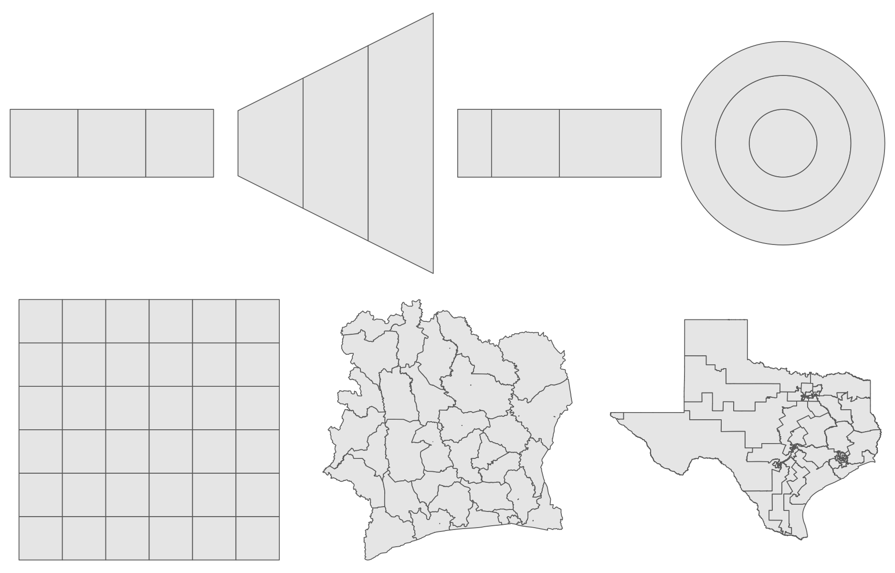

# areal-comparison

Code for the manuscript Howes *et al.* "Understanding models for spatial structure in small-area estimation" (in preparation).

Small-area estimation models typically use the Besag model, a type of Gaussian Markov random field, to model spatial structure.
However, for irregular geometries, the assumptions made by the Besag model do not seem plausible (in the image below, geometric irregularity is increasing from left to right).
The goal of this work is to determine whether or not, in practice, this matters.
To do so, we consider the performance of eight inferential small-area models:

| Model    | Function |
|----------|--------------|
| Constant | [`constant_inla`](https://github.com/athowes/bsae/blob/master/R/constant.R) |
| Independent and identically distributed | [`iid_inla`](https://github.com/athowes/bsae/blob/master/R/iid.R) |
| Besag | [`besag_inla`](https://github.com/athowes/bsae/blob/master/R/besag.R) |
| Besag-York-Mollié  2 | [`bym2_inla`](https://github.com/athowes/bsae/blob/master/R/bym2.R) |
| Centroid kernel (fixed lengthscale) | [`fck_inla`](https://github.com/athowes/bsae/blob/master/R/fck.R) |
| Integrated kernel (fixed lengthscale) | [`fik_inla`](https://github.com/athowes/bsae/blob/master/R/fik.R) |
| Centroid kernel | [`ck_stan`](https://github.com/athowes/bsae/blob/master/R/ck.R) |
| Integrated kernel | [`ik_stan`](https://github.com/athowes/bsae/blob/master/R/ik.R) |



## R package dependencies

This analysis is supported by the [`bsae`](https://github.com/athowes/bsae) package, which can be installed from Github via:

```r
devtools::install_github("athowes/bsae")
```

Additionally, the `R-INLA` package is not currently available on CRAN, and instead may be installed by following [instructions](https://www.r-inla.org/download-install) from the project website.

## File structure

The directories of this repository are:

| Directory   | Contains |
|-------------|--------------|
| `make`      | Scripts used to run the reports. `_make.R` runs everything in order. |
| `misc`      | Miscellaneous code, not used as part of `orderly`. |
| `src`       | All `orderly` reports. |
| `utils`     | Helper scripts for common development tasks. |

Within the `src` directory, reports are prefixed by a number (0-2) designating:

| Prefix | Description |
|---------------|--------------|
| 0             | Applicable to both studies. |
| 1             | Corresponds to the study on simulated data (see Section 5 of the manuscript). |
| 2             | Corresponds to the study on HIV data from household surveys in sub-Saharan Africa (see Section 6 of the manuscript). |

## `orderly`

We use the [`orderly`](https://github.com/vimc/orderly) package ([RESIDE, 2020](https://reside-ic.github.io/)) to simplify the process of doing reproducible research.
After installing [`orderly`](https://github.com/vimc/orderly) (from either CRAN or Github) a report, let's say called `example`, may be run by:

```r
orderly::orderly_run(name = "src/example")
```

The results of this run will appear in the `draft/` folder (ignored on Github).
To commit the draft (with associated `id`) to the `archive/` folder (also ignored on Github, and which should be treated as "read only") use:

```r
orderly::orderly_commit(id)
```

Any outputs of this report will then be available to use as dependencies within other reports.
